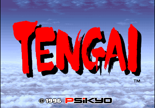
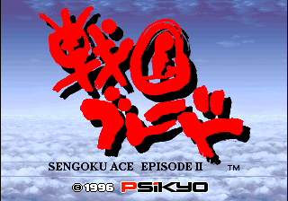
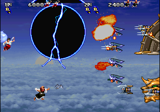

# Psikyo core for MiSTer

MiSTer FPGA core for the original Psikyo arcade hardware, built with Quartus Prime
17.0.2 Lite for the DE10-nano.

Supports the following 68EC020-based games

| Name | Year | Board | Notes |
|-|-|-|-|
| Samurai Aces (World) / Sengoku Ace (Japan) | 1993 | SH201B | |
| Gunbird | 1994 | KA302C | Banpresto License |
| Battle K-Road | 1994 | KA302C | |
| Strikers 1945 |  1995 | SH403/SH404 | SH403 (Unprotected) is similar to KA302C |
| Sengoku Blade: Sengoku Ace Episode II (Japan) / Tengai (World) | 1996 | SH404 | | | SH404 has MCU, YMF278B for sound, and gfx banking. See `docs/phase2_sh404.md` |

## Screenshots

### Samurai Aces (World) / Sengoku Ace (Japan)

### Gunbird

### Battle K-Road

### Strikers 1945

### Sengoku Blade: Sengoku Ace Episode II (Japan) / Tengai (World)

## Installation
As per norm:

* Take the latest *.rbf from the releases/ folder and put it in _Arcade/cores
* Take all the *.mra and _alternatives folder from releases/ and put it into _Arcade (or a subdirectory starting with an underscore)
* Put the MAME merged, or split roms in games/mame

## Status

Games are in good shape, with minor graphical and audio issues. Builds are published in `releases/`.

Details:

* 68EC020 (TG68K kernel at 16 MHz)
* SH403/SH404 security-device simulation (`rtl/cpu/s1945_mcu.sv`) and bctrl tile banking
* Both tilemap layers, sprites, palette, DIP switches, inputs
* Rotation and 180° flip over HDMI via the HPS framebuffer
* CPU pause button suspends main CPU (only)
* Some improvements to priorities and background clear over MAME (which has regressed over the years)

* **Audio may have residual distortion/crackle.**
* **SH404 audio: from-scratch YMF278B (OPL4)
  core (`rtl/sound/opl4/`, built against MAME's ymfm reference - see
  `docs/phase2_ymf278b.md`): full bus protocol, chip ID/status/busy, both timers with the IRQ the Z80 driver's sequencer runs on, and the 24-channel PCM wavetable engine
  that plays the games' 2-4MB sample ROMs. **FM synthesis is deliberately not
  implemented**: measured on hardware (Strikers 1945 Korea, via the OPL4
  FM-usage JTAG probe, `scripts/read_issp.tcl` instance `F`), the sound driver
  performs 34,655 FM register writes and 7,799 PCM key-ons but **zero FM
  key-ons** -- it programs the FM half and never keys a channel on, so no FM
  voice can be audible. The register writes still have to be accepted, and the
  chip's status/timer behaviour still has to be right, which the core does.
  Worth re-checking on Tengai, which runs a different sound program.
* **Timing on `clk_sys` is close to, but not at, full closure.** Four audited multicycle constraint families - TG68K kernel, T80 sound CPU, video pixel-path into the palette lookups, and jt12 slot-scan into the phase generator plus its audited siblings - are recorded, each with its audit reasoning, in `Psikyo.sdc` itself, and eliminated their whole violation families (clk_sys TNS fell from roughly -300 to single digits). The remaining real violations are the sprite render engine's full-rate per-column pixel path, plus milli-ns fit noise in the vendored `sys/` scandoubler (which the framework's own `sys_top.sdc` does not constrain, and which is inactive on this project's HDMI-framebuffer output path) and trivial `jt12_mmr` stragglers.

## Resource usage

Instrumented (`Psikyo_stp`) revision on the DE10-nano's Cyclone V 5CSEBA6:

| resource | used | available | % |
| --- | --- | --- | --- |
| Logic (ALMs) | 26,800 | 41,910 | 64% |
| Registers | 37,446 | -- | -- |
| **M10K blocks** | **553** | **553** | **100%** |
| Block memory bits | 4,321,952 | 5,662,720 | 76% |
| DSP blocks | 58 | 112 | 52% |
| Pins | 145 | 314 | 46% |

**Memory is the binding constraint, not logic.** Budget new features in M10K
blocks: there is roughly a third of the device's logic free and half its DSPs,
but not one spare block of RAM.

Note the two memory rows disagree -- 76% of the bits but 100% of the blocks.
An M10K's usable widths are powers of two, so an array that is not (the two
sprite frame buffers are 71680 x 12) packs at well under full density. A
12-bit word occupies an M10K's x16 mode, wasting a quarter of every block it
touches: 640 words per block, so 112 blocks per buffer and 224 for the pair.

Splitting each into an 8-bit and a 4-bit array would use their native x8 and
x4 modes -- 70 + 35 blocks, so about 14 blocks recovered across both buffers.
That estimate is arithmetic, not a fit result, and Quartus may pack otherwise.
It is also the one lever known to exist, and it happens to be roughly the size
of the V-Size shortfall, so it is where to start if V-Size is wanted.

Consequences worth knowing before planning work:

* Anything memory-shaped needs something else given up first. Raiden's
  `crt_vsize` (V-Size) would need ~150 Kbit, about 15 blocks, so it cannot go
  in as things stand.
* Logic-only additions -- H-Size, further pipeline splits for timing closure,
  extra SDC families -- are unconstrained.
* The release (`Psikyo`) revision does **not** help. Dropping SignalTap and the
  debug tracer saves about 1,000 ALMs and 41,000 memory bits, but the fit still
  reports 553/553 blocks -- the savings are spread across blocks that are still
  needed, so no whole block comes free. Measured, not assumed: release fits at
  25,754 ALMs (61%) and the same 553 blocks.

## Todo

* Confirm the FM finding on Tengai (a different sound program to s1945)
* Add hiscore.v, CRT Offset, fast rom loading
* Port to the Analogue Pocket (openFPGA)

## AI attestation

This core was developed as a test of the use of frontier coding assistants and
a way for me to up-skill. It's a platform I'm familiar with, as I collaborated
with other members of the MAME team on the video system to add the later games,
and the video system is the biggest part of the 'port'.

This could be labelled vibe-coding, since I never touched a line of
VHDL/Verilog myself, doing it all through the agent. However, I'm an
experienced software engineer with several decades of experience across many
languages/environments including real-time/systems, as well as an education in
Electronic Engineering.

I had to bail out Claude a fair few times -- redirecting it from altering
stable CPU implementations to wire in new signals, or blaming timing on what
clearly were logic issues. I had to feed it memory dumps, and decode things
manually, and guide it to build an effective set of tools -- initially in the
absence of JTAG/in-circuit debugging. See [the transcript of our
conversations](docs/chat-export/session-transcript.md) if you're interested.

This has NOT been verified against a PCB other than the timing measurements
back in the day and recorded in the MAME source. However, there's lots of
strong evidence in the (later, especially) games to validate the
tilemap/sprite positioning, priority, transparency, scroll behaviour where a
single frame lag, or a single pixel offset shows up glaringly. If I had a PCB,
and the appropriate skills, I would want to determine the role of each of the
custom chips, probe them to find the correct level of separation and behaviour
w.r.t signals. However, I believe this is largely unnecessary in this case.

## Verification

Development was heavily AI-assisted, combined with experience of the platform from the original MAME emulation that I assisted with many years ago. This is not PCB-validated at the chip-level. It has been validated against MAME, and it's various hardware tests including timings, MAMETesters reports etc.

* **The `sim/` suite** — a per-module ModelSim testbench for every project-authored block (bus wrapper, security-device simulation, the full SDRAM backend and its arbiters/bridges, every stage of the sprite and tilemap pipelines, compositor, video registers, sound CPU decode), plus integration benches that run the whole video pipeline against the real SDRAM controller and chip model. 
* Behavior is checked against MAME's `psikyo.cpp`/`psikyo_v.cpp` as the reference, including regression tests written for every hardware-found bug.
* **Manual testing on a real DE10-nano** — every supported game is played and A/B-compared against MAME on real hardware before release; the debugging instrumentation below (overlay, ISSP probes, API screenshots, video capture) exists to make those hardware observations precise.

## Release process

Two Quartus revisions, and they are held to different standards.

| | `Psikyo_stp` (debug) | `Psikyo` (release) |
| --- | --- | --- |
| Built by | `build_staged.py` (default) | `build_staged.py --rev Psikyo` |
| Contains | SignalTap, debug tracer, Debug OSD page | none of it -- compiled out |
| Timing | **may ship with negative slack** | **must close timing** |
| Goes to | our own DE10-nano | `releases/`, other people's hardware |

The asymmetry is the point. A debug build runs on hardware we control and in
front of someone who knows what a marginal path looks like, and the
instrumentation itself costs timing we have no intention of paying in a
release. A release build goes to hardware we cannot see, where a path that
only just fails becomes an intermittent glitch someone else has to chase and
cannot diagnose. So negative slack is qualified for the debug revision and
disqualifying for a release.

`build_staged.py` enforces this rather than leaving it to memory: on a release
revision it reads every clock in the `.sta.summary` -- not just `clk_sys` --
and refuses to print the deploy command if any of them fail, naming the
offenders. `--allow-negative-slack` overrides it, prints a warning instead,
and obliges you to state the shortfall in the release notes. Reach for it
knowingly or not at all.

Steps for a release:

1. `python scripts/build_staged.py --rev Psikyo` -- must pass the timing gate.
2. Smoketest the five parent games (`scripts/smoketest.py`), which loads each
   and captures screenshots.
3. Deploy and play-test; the debug revision is the one to reach for if
   anything needs diagnosing.
4. Publish the `.rbf` and the `.mra` set together under `releases/`. They are
   coupled -- the SDRAM layout and the ROM-load path are both encoded in the
   MRAs, so a mismatched pair fails in ways that look like core bugs.

**Current state: the core does not pass this gate.** Worst setup slack is
about -4.8 ns on `clk_sys`, from the OPL4 PCM pipeline; splitting it across
more states recovered roughly 2 ns of a 6.6 ns hole and further splits are the
known next lever. Until that closes, builds are debug builds.

## License

GPL v3 (see `LICENSE`). Imported components keep their own licenses and are
GPLv3-compatible: jt10/jt49 (jotego, GPLv3), the adapted SDR SDRAM controller (Sorgelig, GPL-3.0-or-later), screen_rotate (Sorgelig, GPLv2), T80, TG68K.C, and the MiSTer framework `sys/`.

Game ROMs contain copyrighted material and are not included. Obtaining them is your responsibility.

## Acknowledgements

- **Sorgelig** and the **MiSTer-devel team** for the
  [Template_MiSTer](https://github.com/MiSTer-devel/Template_MiSTer) framework this
  project is seeded from, the SDRAM controller (`sdram.sv`, vendored via
  [Arcade-Jackal_MiSTer](https://github.com/MiSTer-devel/Arcade-Jackal_MiSTer) and
  extended here to burst-4 reads — see `rtl/memory/sdram/PROVENANCE.md`), and the
  screen-rotation module (`screen_rotate_two.sv`, taken from
  [Arcade-SKNS_MiSTer](https://github.com/MiSTer-devel/Arcade-SKNS_MiSTer)).
- **Tobias Gubener** ([TobiFlex](https://github.com/TobiFlex)) for
  [TG68K.C](https://github.com/TobiFlex/TG68K.C), the 68EC020 main CPU core.
- **Daniel Wallner** for the **T80** Z80 CPU core, vendored via
  [MiSTer-devel/T80](https://github.com/MiSTer-devel/T80) (maintained since by MikeJ and
  the MiSTer-devel community); used as the sound CPU on the SH201B/KA302C boards.
- **Jose Tejada** ([@jotego](https://github.com/jotego)) for
  [jt10](https://github.com/jotego/jt12) (YM2610) and
  [jt49](https://github.com/jotego/jt49) (its embedded AY-3-8910-compatible SSG channel),
  from the JTFRAME family of sound cores.
- The **MAMEdev team** (especially Olivier Galibert, R. Belmont and Luca Elia as well as my own work) for [MAME](https://github.com/mamedev/mame)'s `psikyo.cpp`/
  `psikyo_v.cpp` driver — the reference this core's memory maps, video timing, and sprite/tilemap semantics are verified against. Also, the OPL4 / YMF278B wavetable engine.

## Layout

Standard [Template_MiSTer](https://github.com/MiSTer-devel/Template_MiSTer) structure:

| path | contents |
| - | - |
| `sys` | MiSTer framework, vendored from the template |
| `rtl` | core source |
| `releases` | `.mra` files, and `.rbf` builds once any are published |
| `docs` | design notes and hard-won debugging lessons |
| `sim` | ModelSim testbenches |
| `scripts` | build/deploy/verification tooling (see below) |
| `debug` | reference traces and captures used as ground truth |

## Tooling

Hardware iteration is automated; see `docs/LESSONS_LEARNED.md` for why each of these exists.

| script | purpose |
| - | - |
| `build_staged.py` | build a git-worktree snapshot of HEAD in `build/` (gitignored), so the main tree stays editable mid-build; the log, `output_files/` and a `BUILT_COMMIT` stamp land under `build/`. Default revision is the instrumented `Psikyo_stp` (fitter SEED pinned at 7 - the default-seed fit did not boot); `-rev Psikyo` for release |
| `mister_hw_test.py` | deploy a `.rbf`, launch a `.mra`, pull a screenshot |
| `deploy_rbf.py` | deploy only if the build actually succeeded |
| `deploy_mra.py` | validate an `.mra`, then copy it |
| `validate_mra.py` | check `.mra` well-formedness and structure |
| `verify_rom_trace.py` | solve a ROM interleave against a hardware trace |
| `decode_trace.py` | decode a debug-overlay capture, saved per settings |
| `decode_vram.py` | extract tilemap VRAM and video registers from a capture |
| `png_census.py` | colour census of a screenshot |

Credentials are read from `mister.env` (gitignored).

## Debugging on hardware

The core carries an optional debug overlay that drives internal state onto the video
output, decoded by the scripts above. It is enabled from the OSD's Debug page - visible
only on instrumented (`Psikyo_stp`) builds: every Debug-page line in the CONF_STR carries
an `H1` prefix, and `status_menumask` bit 1 tracks the `DEBUG_ISSP` macro, so release
builds hide the page. The tracer itself (trace buffers, overlay dump bands) also compiles
out of release builds entirely (`DEBUG_TRACER_EN` tracks the same macro, reclaiming the
BRAM); the non-tracer debug bits (render disable, sprite swap, Sound IRQ, C00008) stay
functional in a release build if set via the `.CFG`. The overlay can dump
tilemap VRAM, the video registers, and a CPU ROM-read trace without rebuilding. It was
built because there was no JTAG on this setup; `docs/LESSONS_LEARNED.md` explains how to
use it without fooling yourself.

JTAG is supported, which makes SignalTap, In-System Sources and Probes, and the
In-System Memory Content Editor usable. Instrumented (`Psikyo_stp`) builds carry a
handful of purpose-built ISSP probes for specific investigations: a tilemap VRAM
write/poke probe (instance `"W"`, `scripts/write_vram1.tcl`) and a spriteram read probe
(instance `"S"`, `scripts/read_spriteram.tcl`), which root-caused the (now fixed)
sprite-vs-tilemap priority bug. A USB video capture device is also available; it is
the right tool for anything temporal (game speed under load, one-frame flashes, flicker),
where the one-shot API screenshots cannot help. Use capture for temporal questions and API
screenshots for pixel-exact ones, since HDMI output is scaled.
