# Psikyo core for MiSTer

MiSTer FPGA core for the original 68k Psikyo (pronounced "SIGH-kyoh" from the Japanese word Saikyō (最強), which means "strongest.") arcade platform(s) that preceded the Hitachi SH-2 era, built with Quartus Prime 17.0.2 Lite for the DE10-nano.

Supports the following games

| Name | Year | Board | Notes |
|-|-|-|-|
| Samurai Aces (World) / Sengoku Ace (Japan) | 1993 | SH201B | |
| Gunbird | 1994 | KA302C | Banpresto License |
| Battle K-Road | 1994 | KA302C | |
| Strikers 1945 |  1995 | SH403 / SH404 | SH403 (Unprotected) is similar to KA302C |
| Sengoku Blade: Sengoku Ace Episode II (Japan) / Tengai (World) | 1996 | SH404 | | | SH404 has MCU, YMF278B for sound, and gfx banking. See `docs/phase2_sh404.md` |

## History

* Arcade-Psikyo_20260904.rbf
  * Fix total loss of sound in Strikers 1945 and Tengai, a regression in 20260903
  * **Intentionally broken HQ2X scaler to close timing still**

* Arcade-Psikyo_20260903.rbf
  * I think the scratchy/distorted sound in Gunbird, Samurai Aces and Battle K-Road (YM2610) is now fixed
  * **Intentionally broken HQ2X scaler to close timing still**

* Arcade-Psikyo_20260901.rbf
  * **Intentionally broken HQ2X scaler to close timing**
  * Fix 6 button controls for "Battle K-Road"
  * Fix bad DIPs in MRAs for some of the alternate sets
  * Remove Framebuffer for buffering in favour of buffering the spriteram to be more like the hardware presumably and save bram

* Arcade-Psikyo_20260830.rbf
  * Initial release

## Screenshots

### Samurai Aces (World) / Sengoku Ace (Japan)

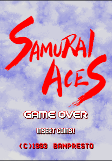

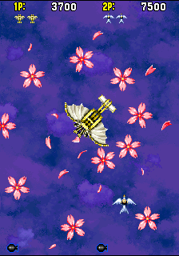
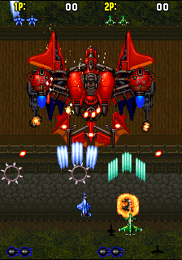
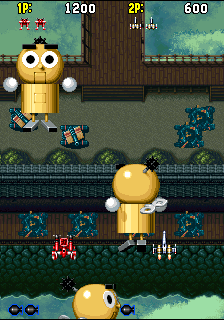
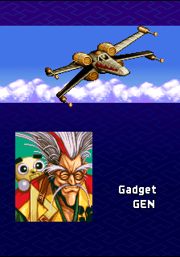
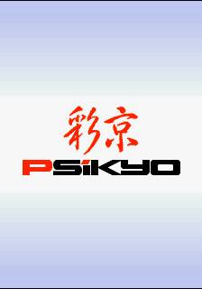

### Gunbird

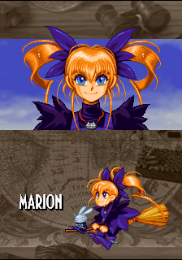
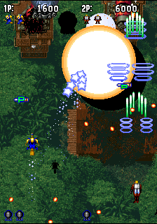
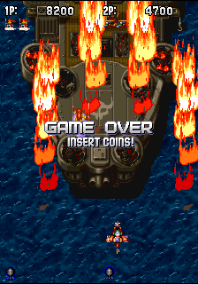
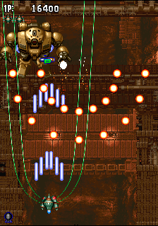

### Battle K-Road

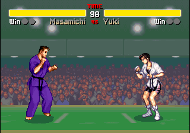
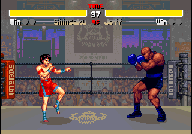
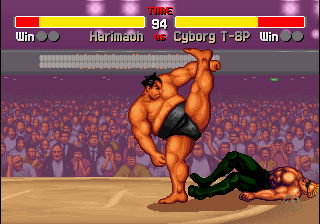

### Strikers 1945

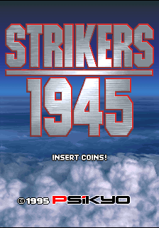
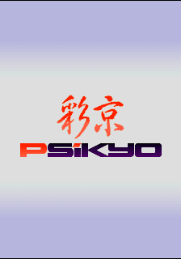
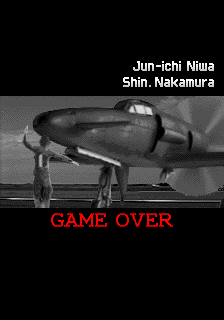
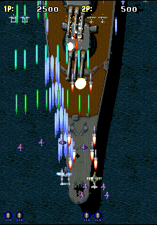

### Sengoku Blade: Sengoku Ace Episode II (Japan) / Tengai (World)

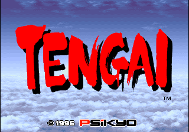
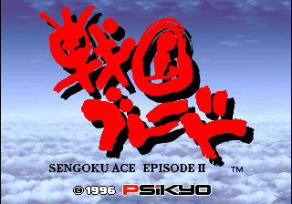

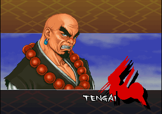
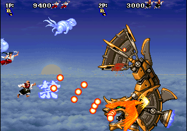
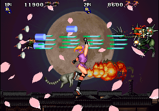
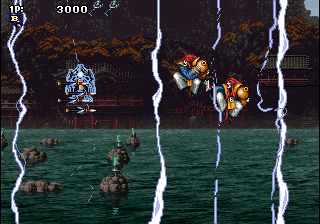
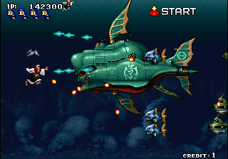

## Installation
As per norm:

* Take the latest *.rbf from the releases/ folder and put it in _Arcade/cores
* Take all the *.mra and _alternatives folder from releases/ and put it into _Arcade (or a subdirectory starting with an underscore)
* Put the MAME merged, or split roms in games/mame

## Status

Games are in good shape, with minor graphical issues around screen clear.
The release revision closes timing (worst-case clk_sys setup slack
+0.220 ns, zero failing paths on any clock).

Details:

* 68EC020 (TG68K kernel at 16 MHz)
* SH403/SH404 security-device simulation (`rtl/cpu/s1945_mcu.sv`) and bctrl tile banking
* **SH404 audio: from-scratch YMF278B (OPL4) core** (`rtl/sound/opl4/`, 
  built against MAME's ymfm reference - see `docs/phase2_ymf278b.md`): full bus protocol, chip ID/status/busy, both timers with the IRQ the Z80 driver's sequencer runs on, and the 24-channel PCM wavetable engine. FM synthesis is deliberately not implemented as it's not used on this platform.
* **PS2001B, PS3103, PS3204, PS3305 custom chips** - Both tilemap layers (with per-line and per-tile scroll), sprites, palette, buffering, compositor
* **Per-scanline sprite rendering** (`rtl/video/sprite_line_engine.sv`): sprites are
  rendered a line ahead of scanout into a double-buffered 320-pixel line buffer,
  the shape the original hardware and the rest of the MiSTer ecosystem use. This
  replaced a 1.7 Mbit whole-frame buffer, which is where most of the block RAM
  used to go. A per-frame pass builds a compact display-list table in vblank so
  the per-line cost stays affordable. See `docs/sprite_buffering.md`.
* Rotation and 180° flip over HDMI via the HPS framebuffer, H-Position and V-Offset
  from CRT Offset. H-Size/V-Size are still not implemented, but the block RAM that
  blocked them is now free -- see Resource usage.
* CPU pause button suspends main CPU (only)
* Fast ROM loading via DDR
* Hiscore saving (with auto-saving)
* Some improvements to priorities and background clear over MAME (which has regressed over the years)

### Todo

- [ ] Implement the Flipscreen DIP, for CRT owners
- [ ] Screen Clear / background colour is still unclear. Currently taken from the highest priority visible tilemap, falling back to pen 0
- [ ] Port to the Analogue Pocket (openFPGA) - looking unlikely

### Resource usage

On the DE10-nano's Cyclone V 5CSEBA6, both revisions:

| resource | release (`Psikyo`) | instrumented (`Psikyo_stp`) | available |
| --- | --- | --- | --- |
| Logic (ALMs) | 26,034 (62%) | 27,481 (66%) | 41,910 |
| Registers | 36,528 | 38,679 | -- |
| M10K blocks | 358 (65%) | 429 (78%) | 553 |
| Block memory bits | 2,647,383 (47%) | 3,214,935 (57%) | 5,662,720 |
| DSP blocks | 63 (56%) | 63 (56%) | 112 |
| Pins | 145 (46%) | 145 (46%) | 314 |

**Block RAM is no longer full ** It was 553/553 blocks until the whole-frame sprite renderer was replaced by the per-scanline path (see `docs/sprite_buffering.md`).

## AI Attestation

This core was developed as a test of the use of frontier coding assistants and
a way for me to up-skill. It's a platform I'm familiar with, as I collaborated
with other members of the MAME team on the video system to add the later games circa ~2002, and the video system is the biggest part of the 'port'. Overall I spent about 3 days getting to the point where I had some the game logic running for the first 3 games, sprites and tilemaps mostly okay, with no in-line debugging possible. This included one day of initial build, one wasted day, and one productive day once we'd built a simulation of the entire renderer stack to fix one particularly nasty bug with the tilemaps. Then, another day was spent adding support for the later games, including the MCU simulation and OPL4. The final day was adding all the expected components like CRT Offset, hiscore, fast ROM loading, and polish (rendering fixes and timing).

This could be labelled vibe-coding, since I never touched a line of
VHDL/Verilog myself, doing it all through the agent. However, I'm an
experienced software engineer with several decades of experience across many
languages/environments including real-time/systems, as well as an education in
Electronic Engineering.

I had to bail out Claude a fair few times -- redirecting it from altering
stable CPU implementations to wire in new signals, or blaming timing on what
clearly were logic issues. I had to feed it memory dumps, and decode things
manually, and guide it to build an effective set of tools -- initially in the
absence of JTAG/in-circuit debugging it figured out the availability of Mister Remote after giving it SFTP access, and built a whole series of debug overlays to dump cpu instruction traces, and various memory areas. I was also able to leave it unsupervised on large builts/optimsation passes, as well as managing it remotely from a phoen app with it posting images or analysis for me to review. See [the transcript of our conversations](docs/chat-export/session-transcript.md) if you're interested.

This has NOT been verified against a PCB other than the timing measurements
back in the day and recorded in the MAME source. However, there's lots of
strong evidence in the (later, especially) games to validate the
tilemap/sprite positioning, priority, transparency, scroll behaviour where a
single frame lag, or a single pixel offset shows up glaringly. If I had a PCB,
and the appropriate skills, I would want to determine the role of each of the
custom chips, probe them to find the correct level of separation and behaviour
w.r.t signals. However, I believe this is largely unnecessary in this case.

## Verification

Development was heavily AI-assisted, combined with experience of the platform from the original MAME emulation that I assisted with many years ago. This is not PCB-validated at the chip-level. It has been validated against MAME, and it's various hardware tests including timings, MAMETesters reports etc.

* **The `sim/` suite** — a per-module ModelSim testbench for every project-authored block (bus wrapper, security-device simulation, the full SDRAM backend and its arbiters/bridges, every stage of the sprite and tilemap pipelines, compositor, video registers, sound CPU decode), plus integration benches that run the whole video pipeline against the real SDRAM controller and chip model. 
* Behavior is checked against MAME's `psikyo.cpp`/`psikyo_v.cpp` as the reference, including regression tests written for every hardware-found bug.
* **Manual testing on a real DE10-nano** — every supported game is played and A/B-compared against MAME on real hardware before release; the debugging instrumentation below (overlay, ISSP probes, API screenshots, video capture) exists to make those hardware observations precise.

## Acknowledgements

- **Sorgelig** and the **MiSTer-devel team** for the
  - [Template_MiSTer](https://github.com/MiSTer-devel/Template_MiSTer) framework this
  project is seeded from
  - The SDRAM controller (`sdram.sv`, vendored via
  [Arcade-Jackal_MiSTer](https://github.com/MiSTer-devel/Arcade-Jackal_MiSTer) and
  extended here to burst-4 reads
  - The screen-rotation module (`screen_rotate_two.sv`, taken from
  [Arcade-SKNS_MiSTer](https://github.com/MiSTer-devel/Arcade-SKNS_MiSTer)).
  - The fast-ROM-load capability
- The **MAMEdev team** (especially Olivier Galibert, R. Belmont and Luca Elia as well as my own work) for [MAME](https://github.com/mamedev/mame)'s `psikyo.cpp`/
  `psikyo_v.cpp` driver — the reference this core's memory maps, video timing, and sprite/tilemap semantics are verified against. Also, the OPL4 / YMF278B wavetable engine.
- **Tobias Gubener** ([TobiFlex](https://github.com/TobiFlex)) for
  [TG68K.C](https://github.com/TobiFlex/TG68K.C), the 68EC020 main CPU core.
- **Daniel Wallner** for the **T80** Z80 CPU core, vendored via
  [MiSTer-devel/T80](https://github.com/MiSTer-devel/T80) (maintained since by MikeJ and
  the MiSTer-devel community); used as the sound CPU on the SH201B/KA302C boards.
- **Jose Tejada** ([@jotego](https://github.com/jotego)) for
  [jt10](https://github.com/jotego/jt12) (YM2610) and
  [jt49](https://github.com/jotego/jt49) (its embedded AY-3-8910-compatible SSG channel),
  from the JTFRAME family of sound cores.
- **Alan Steremberg** and **Jim Gregory** ([JimmyStones](https://github.com/JimmyStones))
  for [Hiscores_MiSTer](https://github.com/JimmyStones/Hiscores_MiSTer) — `rtl/hiscore.v`, the per-game latching config came
  from MAME's own [hiscore.dat](https://github.com/mamedev/mame/blob/master/plugins/hiscore/hiscore.dat).
- **I Beceri Videoludici** ([rmonic79](https://github.com/rmonic79)) for CRT Offset
- Many open-source Mister cores for reference, including **Sergiy Dvodnenko** ([srg320](https://github.com/srg320)) for PsikyoSH and SKNS cores as reference

## Layout

Standard [Template_MiSTer](https://github.com/MiSTer-devel/Template_MiSTer) structure:

| path | contents |
| - | - |
| `sys` | MiSTer framework, vendored from the template |
| `rtl` | core source |
| `releases` | `.mra` files, and `.rbf` builds once any are published |
| `docs` | design notes and hard-won debugging lessons |
| `sim` | ModelSim testbenches |
| `scripts` | build/deploy/verification tooling (see below) |
| `debug` | reference traces and captures used as ground truth |

## Tooling

Hardware iteration is automated; see `docs/LESSONS_LEARNED.md` for why each of these exists.

| script | purpose |
| - | - |
| `build_staged.py` | build a git-worktree snapshot of HEAD in `build/` (gitignored), so the main tree stays editable mid-build; the log, `output_files/` and a `BUILT_COMMIT` stamp land under `build/`. Default revision is the instrumented `Psikyo_stp` (fitter SEED pinned at 7 - the default-seed fit did not boot); `-rev Psikyo` for release. Release builds are gated on timing -- see [docs/RELEASE_PROCESS.md](docs/RELEASE_PROCESS.md) |
| `mister_hw_test.py` | deploy a `.rbf`, launch a `.mra`, pull a screenshot |
| `deploy_rbf.py` | deploy only if the build actually succeeded |
| `deploy_mra.py` | validate an `.mra`, then copy it |
| `validate_mra.py` | check `.mra` well-formedness and structure |
| `verify_rom_trace.py` | solve a ROM interleave against a hardware trace |
| `decode_trace.py` | decode a debug-overlay capture, saved per settings |
| `decode_vram.py` | extract tilemap VRAM and video registers from a capture |
| `png_census.py` | colour census of a screenshot |

Credentials are read from `mister.env` (gitignored).

For the debug overlay, the JTAG probes and when to reach for video capture
instead of a screenshot, see
[docs/DEBUGGING_ON_HARDWARE.md](docs/DEBUGGING_ON_HARDWARE.md).

## License

GPL v3 (see `LICENSE`). Imported components keep their own licenses and are
GPLv3-compatible: jt10/jt49 (jotego, GPLv3), the adapted SDR SDRAM controller (Sorgelig, GPL-3.0-or-later), screen_rotate (Sorgelig, GPLv2), T80, TG68K.C, and the MiSTer framework `sys/`.

Game ROMs contain copyrighted material and are not included. Obtaining them is your responsibility.
